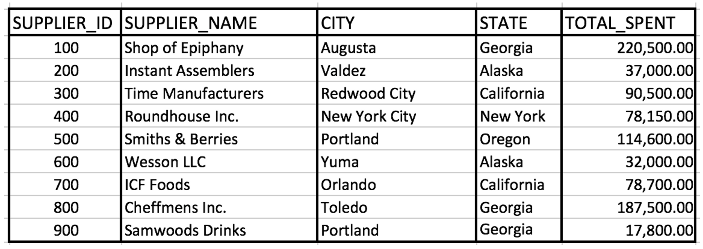

# Assignment 1: Practice with Single Table Queries
In this assignment, you'll have the opportunity to practice everything you've learned in this section. DO NOT SKIP THIS ASSIGNMENT!

Review the data in the suppliers table shown below and answer the questions that follow. There is no SQL provided to load this data into the database because we're simulating an examination scenario. You will not have access to a code editor during the exam so you have to use images. Get practice with seeing images of data and trying to solve the puzzles.



## Questions for this assignment
1. Write a query that retrieves suppliers that work in either Georgia or California.
```SQL
select * from suppliers
where state in ('Georgia', 'California')
```

2. Write a query that retrieves suppliers with the characters "wo" and the character "I" or "i" in their name.
```SQL
select * from suppliers
where supplier_name like '%wo%'
and (supplier_name like '%I%' or supplier_name like '%i%')
```

3. Write a query that retrieves suppliers on which a minimum of 37,000 and a maximum of 80,000 was spent.
```SQL
select * from suppliers
where total_spent between 37000 and 80000
```

4. Write a query that returns the supplier names and the state in which they operate meeting the following conditions:
    - belong in the state Georgia or Alaska
    - the supplier id is 100 or greater than 600
    - the amount spent is less than 100,000 or the amount spent is 220,000 
```SQL
select supplier_name, state from suppliers
where state in ('Georgia', 'Alaska')
and (supplier_id = 100 or supplier_id > 600)
and (total_spent < 100000 or total_spent = 220000)
```

5. TRUE or FALSE Question: The keywords such as SELECT and WHERE must always be capital in the SQL Query.

FALSE

6. TRUE or FALSE Question: The database works on first processing the filtering conditions and then processes the FROM condition.

FALSE

7. TRUE or FALSE Question: Having just the filter condition shown below in a SQL query will return all of the records from the table. WHERE 1 = 1

TRUE

8. TRUE or FALSE question: NULL can not be compared using an equal sign.

TRUE

9. TRUE or FALSE question: The ORDER BY clause is processed before the FROM clause in a SQL statement and it's used to sort the columns in an ascending or descending fashion.

FALSE
